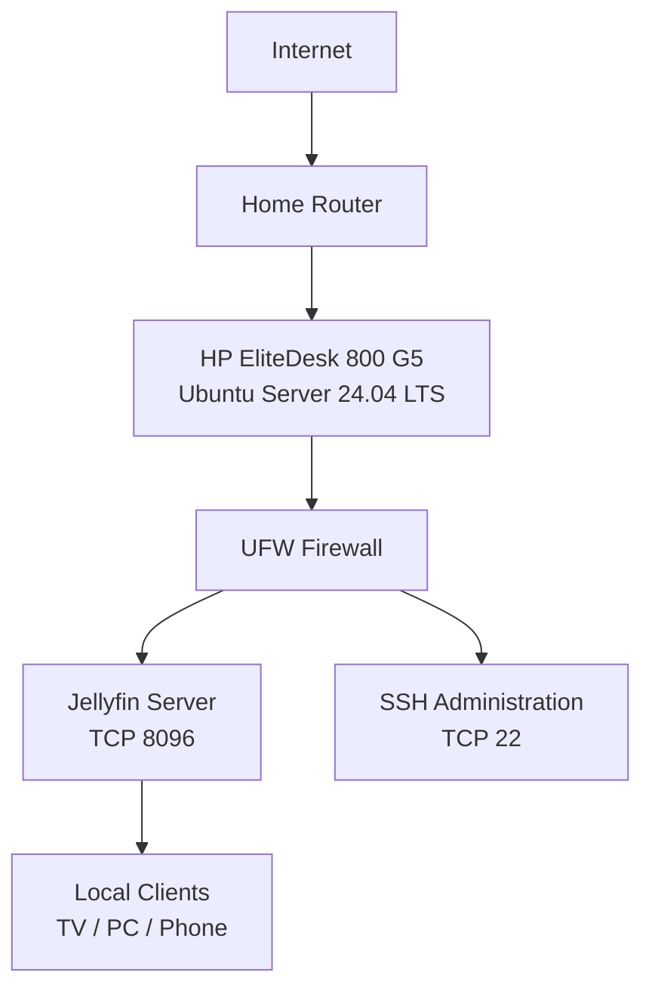

# Network Architecture

## Current Architecture

The Jellyfin server operates as a self-hosted service on the local home network. Client devices connect to the server over the LAN, while administrative access is performed using SSH.

## Architecture Notes

- The server uses a wired Ethernet connection.
- The server resides on the `192.168.0.0/24` private network.
- UFW provides host-level firewall protection.
- Jellyfin accepts client connections using TCP port 8096.
- SSH provides command-line administration of the Ubuntu server.
- The server's exact private IP address is intentionally omitted.
